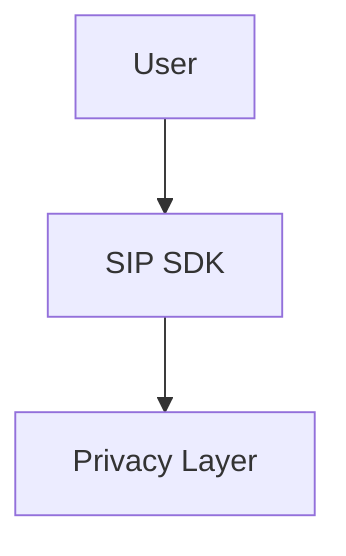

# Contributing to SIP Protocol Documentation

Thank you for your interest in contributing to the SIP Protocol documentation! We welcome contributions from the community to help make our documentation better.

## How to Contribute

### 1. Fork the Repository

Fork the [docs-sip repository](https://github.com/sip-protocol/docs-sip) to your GitHub account.

### 2. Clone Your Fork

```bash
git clone https://github.com/YOUR_USERNAME/docs-sip.git
cd docs-sip
```

### 3. Create a Feature Branch

```bash
git checkout -b feature/your-improvement
```

Use descriptive branch names:
- `docs/add-advanced-example`
- `fix/typo-in-quickstart`
- `improve/architecture-diagram`

### 4. Make Your Changes

Edit the documentation files in `src/content/docs/`. All documentation is written in Markdown (`.md`) or MDX (`.mdx`).

### 5. Test Locally

Always test your changes before submitting:

```bash
# Install dependencies
npm install

# Start development server
npm run dev

# Visit http://localhost:4321 to preview your changes
```

Check that:
- All links work correctly
- Code examples are accurate
- Formatting renders properly
- Images display correctly
- Mermaid diagrams render (if applicable)

### 6. Commit Your Changes

Write clear, descriptive commit messages:

```bash
git add .
git commit -m "docs: add example for custom privacy levels"
```

Follow conventional commit format:
- `docs:` - Documentation changes
- `fix:` - Bug fixes in docs
- `feat:` - New documentation sections
- `improve:` - Improvements to existing docs
- `chore:` - Maintenance tasks

### 7. Push to Your Fork

```bash
git push origin feature/your-improvement
```

### 8. Submit a Pull Request

1. Go to your fork on GitHub
2. Click "Pull Request"
3. Select your branch and target `main`
4. Fill out the PR template with:
   - Description of changes
   - Why the change is needed
   - Screenshots (if UI changes)
   - Related issues

## Development Setup

### Prerequisites

- Node.js 18.0.0 or higher
- npm or pnpm
- Git
- Text editor (VS Code recommended)

### Installation

```bash
# Install dependencies
npm install

# Generate API documentation (from SDK)
npm run docs:api
```

### Available Commands

| Command | Description |
|---------|-------------|
| `npm run dev` | Start dev server at localhost:4321 |
| `npm run build` | Build production site to ./dist/ |
| `npm run preview` | Preview production build |
| `npm run docs:api` | Generate API reference from SDK |
| `npm run docs:api:clean` | Clean and regenerate API docs |

## Documentation Standards

### MDX/Markdown Guidelines

**File Naming:**
- Use lowercase with hyphens: `stealth-address.md`
- Be descriptive: `solver-integration.md` not `integration.md`
- Match sidebar labels when possible

**Front Matter:**
Every documentation file must include front matter:

```yaml
---
title: Page Title
description: Brief description for SEO and social sharing
---
```

**Headings:**
- Use proper heading hierarchy (H1 → H2 → H3)
- One H1 per page (matches title)
- Don't skip heading levels

**Code Blocks:**
- Always specify language: ` ```typescript `
- Include comments for complex code
- Keep examples focused and minimal
- Test code examples when possible

**Links:**
- Use relative links for internal pages: `[Concepts](../concepts/privacy-levels)`
- Use absolute URLs for external sites
- Verify all links work

**Images:**
- Place in `src/assets/` directory
- Use descriptive filenames: `stealth-address-flow.png`
- Include alt text for accessibility
- Optimize file sizes

**Mermaid Diagrams:**
- Use Mermaid for architecture diagrams
- Keep diagrams simple and readable
- Add comments in diagram code

Example:


### Writing Style

- **Clear and concise** - Avoid jargon when possible
- **Active voice** - "The SDK generates..." not "The address is generated..."
- **Present tense** - "The function returns..." not "The function will return..."
- **Second person** - "You can configure..." not "Users can configure..."
- **Consistent terminology** - Use terms from the glossary

### Code Examples

- **Complete** - Include necessary imports and setup
- **Working** - Test before committing
- **Commented** - Explain non-obvious parts
- **Realistic** - Use meaningful variable names
- **Safe** - Don't include private keys or sensitive data

Example:
```typescript
import { SIP, PrivacyLevel } from '@sip-protocol/sdk'

// Initialize SIP client with default config
const sip = new SIP({
  privateKey: process.env.PRIVATE_KEY, // Never hardcode!
  rpcUrl: 'https://rpc.mainnet.near.org'
})

// Create shielded intent
const intent = await sip.createShieldedIntent({
  from: 'alice.near',
  to: 'bob.near',
  amount: '100',
  token: 'NEAR',
  privacyLevel: PrivacyLevel.SHIELDED
})
```

## Pull Request Requirements

Before submitting your PR, ensure:

- [ ] Changes are tested locally (`npm run dev`)
- [ ] All links work and point to correct pages
- [ ] Code examples are tested and working
- [ ] No spelling or grammar errors
- [ ] Images are optimized and have alt text
- [ ] Follows documentation style guidelines
- [ ] PR description explains what and why
- [ ] Related issues are referenced

## Issue Templates

When creating issues, use our templates:

- **Bug Report** - Documentation errors or broken links
- **Documentation Request** - Missing or unclear docs
- **Improvement** - Suggestions for better docs

## Code of Conduct

We are committed to providing a welcoming and inclusive environment. Please be respectful and constructive in all interactions.

**Expected behavior:**
- Be respectful and considerate
- Welcome newcomers and help them learn
- Focus on what is best for the community
- Show empathy towards others

**Unacceptable behavior:**
- Harassment or discriminatory language
- Trolling or insulting comments
- Publishing others' private information
- Any conduct inappropriate in a professional setting

## Getting Help

If you need help contributing:

1. Check existing documentation in `/src/content/docs/`
2. Review [Starlight documentation](https://starlight.astro.build)
3. Open a GitHub issue with the "question" label
4. Join our community discussions

## Recognition

Contributors will be recognized in:
- Git commit history
- Release notes (for significant contributions)
- Our community hall of fame (planned)

## License

By contributing, you agree that your contributions will be licensed under the [MIT License](LICENSE).

---

Thank you for helping improve SIP Protocol documentation! Every contribution, no matter how small, makes a difference.
