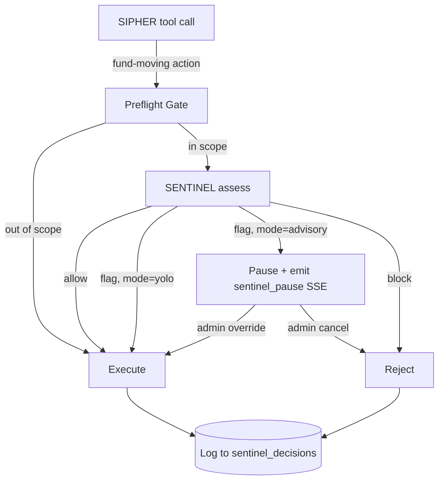

import { Aside } from '@astrojs/starlight/components'

<Aside type="note" title="Source of truth">
This page mirrors [`docs/sentinel/README.md`](https://github.com/sip-protocol/sipher/blob/main/docs/sentinel/README.md) in the [sipher repo](https://github.com/sip-protocol/sipher). For the latest, always check the source. Last synced: **2026-06-06**.
</Aside>

SENTINEL is Sipher's LLM-backed security analyst. Think of it as the security department of an office building: it watches every fund-moving action, flags suspicious wallets, can pause execution for human review, and logs every decision for audit. This folder is the integrator-facing reference for SENTINEL's external surface.

## Sub-references

- [REST API](/sipher/sentinel/rest-api/) — 11 endpoints under `/api/sentinel`
- [Agent Tools](/sipher/sentinel/tools/) — 14 LLM tools + `assessRisk`
- [Configuration](/sipher/sentinel/config/) — 15 environment variables
- [Audit Log Schema](/sipher/sentinel/audit-log/) — SQLite tables + decision record format

## Operating Modes

SENTINEL has three modes selected via `SENTINEL_MODE`:

| Mode | Behavior on flagged action | Use when |
|---|---|---|
| `yolo` | Allow the action; log the decision | Default; trusted operator + own wallet |
| `advisory` | Pause execution; require explicit human override | Production VPS; admin-supervised flows |
| `off` | Skip preflight entirely; log nothing | Local dev; tests that bypass risk checks |

**Default:** `yolo` (parsed in [`packages/agent/src/sentinel/config.ts:30-33`](https://github.com/sip-protocol/sipher/blob/main/packages/agent/src/sentinel/config.ts#L30-L33)).

## Decision Flow



## Quickstart

Authenticate and run a one-shot risk assessment:

```bash
# Get a JWT (see /api/auth/nonce + /api/auth/verify for the full ed25519 flow)
JWT="<your-token>"

curl -X POST http://localhost:3000/api/sentinel/assess \
  -H "Authorization: Bearer $JWT" \
  -H "Content-Type: application/json" \
  -d '{
    "action": "vault_refund",
    "wallet": "C1phrE76Wrkmt1GP6Aa9RjCeLDKHZ7p4MPVRuPa8x85N",
    "amount": 1.5
  }'
```

The response is a `RiskReport` (shape defined in [`packages/agent/src/sentinel/risk-report.ts`](https://github.com/sip-protocol/sipher/blob/main/packages/agent/src/sentinel/risk-report.ts)):

```json
{
  "risk": "high",
  "score": 100,
  "reasons": [
    "SENTINEL output failed schema validation"
  ],
  "recommendation": "block",
  "blockers": [
    "schema-violation"
  ],
  "decisionId": "01KQP24PG0KZCJVWJDQM8H3JAY",
  "durationMs": 440
}
```

:::note
The Sipher agent default port is `5006` (see [`packages/agent/src/index.ts:270`](https://github.com/sip-protocol/sipher/blob/main/packages/agent/src/index.ts#L270)). The `localhost:3000` URL above matches the e2e/Playwright convention. Override with `PORT=<n>` env var.
:::

## Cross-references

- Internal design: [`docs/superpowers/specs/2026-04-15-sentinel-formalization-design.md`](https://github.com/sip-protocol/sipher/blob/main/docs/superpowers/specs/2026-04-15-sentinel-formalization-design.md)
- Surface docs design: [`docs/superpowers/specs/2026-04-27-sentinel-surface-docs-design.md`](https://github.com/sip-protocol/sipher/blob/main/docs/superpowers/specs/2026-04-27-sentinel-surface-docs-design.md)
